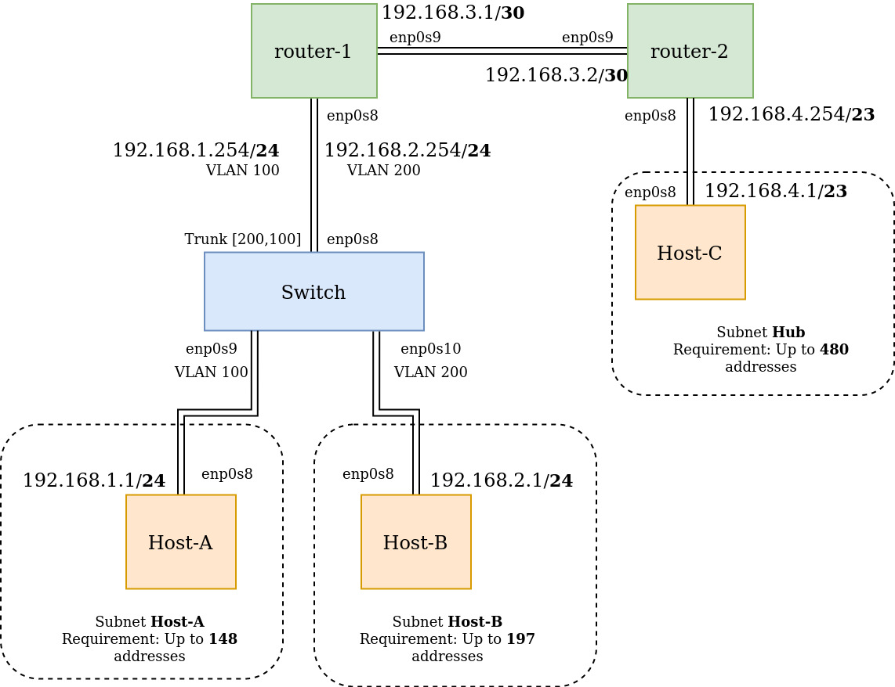

# DNCS-LAB

This repository contains the Vagrant files required to run the virtual lab environment used in the DNCS course.

```


        +-----------------------------------------------------+
        |                                                     |
        |                                                     |eth0
        +--+--+                +------------+             +------------+
        |     |                |            |             |            |
        |     |            eth0|            |eth2     eth2|            |
        |     +----------------+  router-1  +-------------+  router-2  |
        |     |                |            |             |            |
        |     |                |            |             |            |
        |  M  |                +------------+             +------------+
        |  A  |                      |eth1                       |eth1
        |  N  |                      |                           |
        |  A  |                      |                           |
        |  G  |                      |                     +-----+----+
        |  E  |                      |eth1                 |          |
        |  M  |            +-------------------+           |          |
        |  E  |        eth0|                   |           |  host-c  |
        |  N  +------------+      SWITCH       |           |          |
        |  T  |            |                   |           |          |
        |     |            +-------------------+           +----------+
        |  V  |               |eth2         |eth3                |eth0
        |  A  |               |             |                    |
        |  G  |               |             |                    |
        |  R  |               |eth1         |eth1                |
        |  A  |        +----------+     +----------+             |
        |  N  |        |          |     |          |             |
        |  T  |    eth0|          |     |          |             |
        |     +--------+  host-a  |     |  host-b  |             |
        |     |        |          |     |          |             |
        |     |        |          |     |          |             |
        ++-+--+        +----------+     +----------+             |
        | |                              |eth0                   |
        | |                              |                       |
        | +------------------------------+                       |
        |                                                        |
        |                                                        |
        +--------------------------------------------------------+


```

# Requirements

-   Python 3
-   10GB disk storage
-   2GB free RAM
-   Virtualbox
-   Vagrant (https://www.vagrantup.com)
-   Internet

# How-to

-   Install Virtualbox and Vagrant
-   Clone this repository
    `git clone https://github.com/fabrizio-granelli/dncs-lab`
-   You should be able to launch the lab from within the cloned repo folder.

```
cd dncs-lab
[~/dncs-lab] vagrant up
```

Once you launch the vagrant script, it may take a while for the entire topology to become available.

-   Verify the status of the 4 VMs

```
[dncs-lab]$ vagrant status
Current machine states:

router                    running (virtualbox)
switch                    running (virtualbox)
host-a                    running (virtualbox)
host-b                    running (virtualbox)
```

-   Once all the VMs are running verify you can log into all of them:
    `vagrant ssh router`
    `vagrant ssh switch`
    `vagrant ssh host-a`
    `vagrant ssh host-b`
    `vagrant ssh host-c`

# Assignment

This section describes the assignment, its requirements and the tasks the student has to complete.
The assignment consists in a simple piece of design work that students have to carry out to satisfy the requirements described below.
The assignment deliverable consists of a Github repository containing:

-   the code necessary for the infrastructure to be replicated and instantiated
-   an updated README.md file where design decisions and experimental results are illustrated
-   an updated answers.yml file containing the details of your project

## Design Requirements

-   Hosts 1-a and 1-b are in two subnets (_Hosts-A_ and _Hosts-B_) that must be able to scale up to respectively 148 and 197 usable addresses
-   Host 2-c is in a subnet (_Hub_) that needs to accommodate up to 480 usable addresses
-   Host 2-c must run a docker image (dustnic82/nginx-test) which implements a web-server that must be reachable from Host-1-a and Host-1-b
-   No dynamic routing can be used
-   Routes must be as generic as possible
-   The lab setup must be portable and executed just by launching the `vagrant up` command

## Tasks

-   Fork the Github repository: https://github.com/fabrizio-granelli/dncs-lab
-   Clone the repository
-   Run the initiator script (dncs-init). The script generates a custom `answers.yml` file and updates the Readme.md file with specific details automatically generated by the script itself.
    This can be done just once in case the work is being carried out by a group of (<=2) engineers, using the name of the 'squad lead'.
-   Implement the design by integrating the necessary commands into the VM startup scripts (create more if necessary)
-   Modify the Vagrantfile (if necessary)
-   Document the design by expanding this readme file
-   Fill the `answers.yml` file where required (make sure that is committed and pushed to your repository)
-   Commit the changes and push to your own repository
-   Notify the examiner (fabrizio.granelli@unitn.it) that work is complete specifying the Github repository, First Name, Last Name and Matriculation number. This needs to happen at least 7 days prior an exam registration date.

# Notes and References

-   https://rogerdudler.github.io/git-guide/
-   http://therandomsecurityguy.com/openvswitch-cheat-sheet/
-   https://www.cyberciti.biz/faq/howto-linux-configuring-default-route-with-ipcommand/
-   https://www.vagrantup.com/intro/getting-started/

# Design

## Addressing

Based on the lecture there are several ip domains which are reserved for the private networks. In this assignment, it is decided to use ip addresses starting with 192.168.

Subnets addresse space is set to the closest upper (power of 2) - 2. Following subnet configurations have been implemented:

-   Subnet Host-A 192.168.1.0/24 which provides maximum of (2^8)-2=254 addresses
-   Subnet Host-B 192.168.2.0/24 which provides maximum of (2^8)-2=254 addresses
-   Subnet Hub 192.168.4.0/23 which provides maximum of (2^9)-2=510 addresses
-   Link between router requires at most 2 addresses, thats why the address 192.168.3.1/30 is chosen which provides maximum of (2^2)-2=2 addresses

VLAN is convenient way to split existing network into subnetworks. That takes out the need of placing router to split broadcast domains. In this case switch ports are configured to split the network into different VLANs. Additionaly, configuration of router-1 port (connecting the switch) as VLAN port with two subinterfaces and switch port (facing the router) as trunk is required.

Following picture represents final configuration:


## Server configuration

In Ubuntu 18.04 it is suggested to use netplan for all permanent network configurations. Configuration of Static IP and gateway address can be found on [Ubuntu Server page for network configuration](https://ubuntu.com/server/docs/network-configuration). Static routes can be also added through [Netplan api](https://linuxconfig.org/how-to-add-static-route-with-netplan-on-ubuntu-20-04-focal-fossa-linux).

### Hosts

All hosts have default gateway set to the router address. Since there is only one host from each subnet their address start from the lowest available address in the subnets.

### Routers

Routers require static routes to be configured in order to be able send the packet to the next hop address. It is required to configure the forward and backwards routes (router-2 needs to know that it can reach Host-A and Host-B subnets through router-1 and router-1 needs to know that the Hub is reachable through router-2).

By default IP forwarding is not enabled on the Ubuntu Server, it can be enabled by [modifying the /etc/sysctl.conf file](https://www.ducea.com/2006/08/01/how-to-enable-ip-forwarding-in-linux/)

Router-1 can have network interface configured with Subinterfaces in order to be able to receive packets from different VLANs on same network adapter. Permanent configuration is possible through [netplan api](https://askubuntu.com/questions/992428/netplan-with-multiple-vlans-on-single-interface-help-needed).

### Switch

Port connecting host-a is configured as VLAN 100 and port connecting host-b as VLAN 200. Port connecting the router is trunk port configured for VLAN [100,200], with the aim of connecting with router VLAN subinterfaces. Additionaly it might be required to explicitely configure port facing the hosts as `native-untagged` and port connecting the router as `native-tagged` as metioned in [VLAN OVS Q&A](https://docs.openvswitch.org/en/latest/faq/vlan/). For further information on possible configuration one can check the [Open vSwitch Manual](http://www.openvswitch.org/support/dist-docs/ovs-vswitchd.conf.db.5.html).

## Vagrant Configuration

All Virtual machines have separate scripts which should be executed only once in order to set up the required interfaces. Some network paramters can be configured through [Vagrantfile directly](https://www.vagrantup.com/docs/networking/public_network). Anyways, in tutorial most of network configuration commands are being executed as shell commands, thats why it was deceided to configure network through separate shell script.

Vagrant [offers Docker Provisioner support](https://www.vagrantup.com/docs/provisioning/docker). However, one must be careful, [errors caused by dpkg-preconfigure can occure](https://github.com/hashicorp/vagrant/issues/12192). In my case it was solved through memory increase as suggested in [this stackoverflow thread](https://serverfault.com/questions/626836/apt-fatal-failed-to-fork).

In host-c, docker container is set up with nginx image (as showed in the lab). Since by default, IP address of nginx image is 0.0.0.0. it can be accessed by [all IP addresses on the local machine](https://serverfault.com/questions/78048/whats-the-difference-between-ip-address-0-0-0-0-and-127-0-0-1). Meaning that other servers can send url request symply by calling `curl 192.168.4.1` where the ip address is the address of the host machine with docker server running on it.

## Useful commands

### OVS

```

# Dump port configurations
ovs-vsctl list port enp0s8

# Check port status
ovs-ofctl dump-ports-desc br0

# Show learned ports and macs
ovs-appctl fdb/show br0

# Set port as VLAN
ovs-vsctl set port enp0s9 tag=100

# Set trunk configuration
ovs-vsctl set port enp0s8 trunks=100,20

# Remove properties OVS
ovs-vsctl remove port enp0s9 vlan_mode native-untagged

```

### IP related commands

```

# Add address
ip addr add 10.0.2.254 dev enp0s8.100

# Delete port address
ip address del 10.0.2.254/23 dev enp0s8

# Set IP forwarding
sysctl -w net.ipv4.ip_forward=1

# Print out the ip forwarding status:
sysctl net.ipv4.ip_forward

# Assign IP address to the link
ifconfig enp0s9 192.168.1.1/24

# Create VLAN link
ip link add link enp0s8 name enp0s8.100 type vlan id 100

```

## Useful links

[Network configuration with Netplan ](https://linuxize.com/post/how-to-configure-static-ip-address-on-ubuntu-18-04/)

[Routing book](http://www.policyrouting.org/PolicyRoutingBook/ONLINE/CH01.web.html)

[Static routing example: 3 routers + 2 hosts](https://www.ccnablog.com/static-routing/)

[Turn the Linux into router: 2hosts + router in between](https://www.tecmint.com/setup-linux-as-router/)

[Subinterface Router](https://www.practicalnetworking.net/stand-alone/routing-between-vlans/)

[IP command chear sheet](https://access.redhat.com/sites/default/files/attachments/rh_ip_command_cheatsheet_1214_jcs_print.pdf)

[VLAN configuration with IP command](https://wiki.archlinux.org/index.php/VLAN)

[OVS configuration on the machine](https://www.ibm.com/support/knowledgecenter/en/SSXK2N_1.4.3/com.ibm.powervc.standard.help.doc/powervc_manage_kvm_ubuntu.html)

[Native Tunneling in Open vSwitch userspace](http://www.openvswitch.org//support/dist-docs-2.5/README-native-tunneling.md.txt)

[Tutorials OVS Faucet](https://docs.openvswitch.org/en/latest/tutorials/faucet/)

[Useful commands OVS](https://support.citrix.com/article/CTX217744)

[Broadcast with Switches](https://www.homenethowto.com/switching/switches/)
